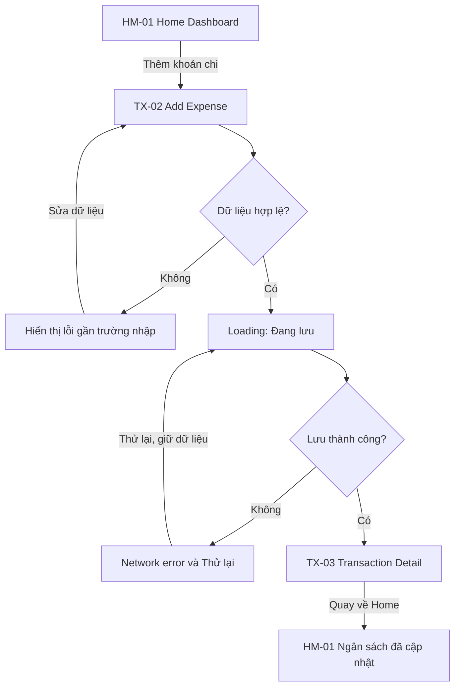
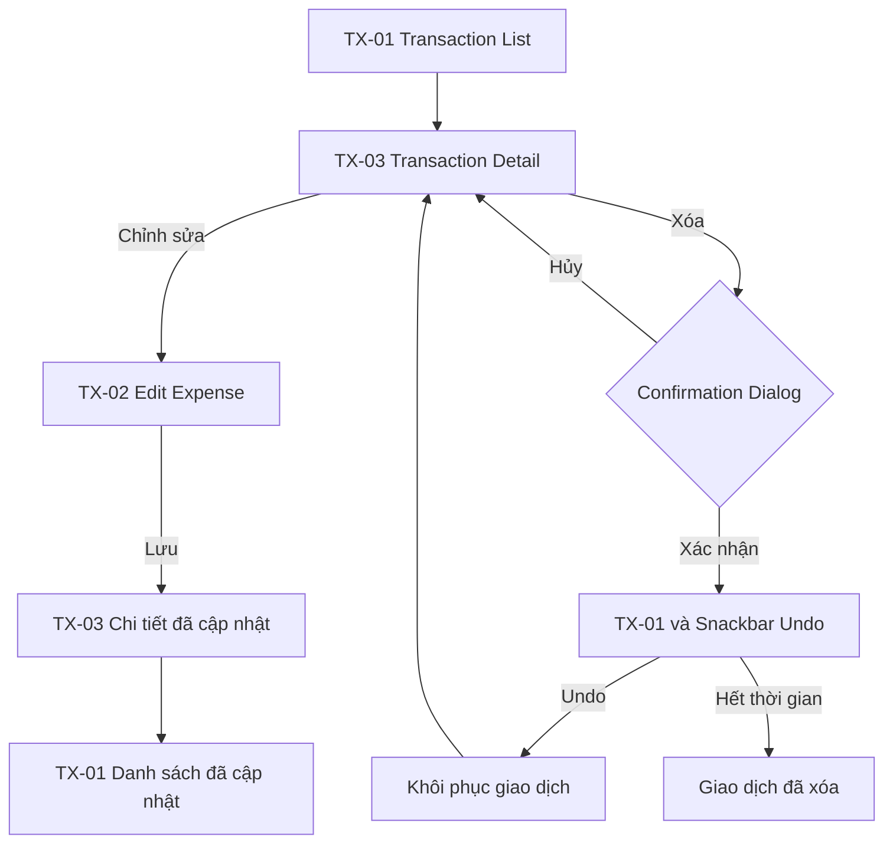
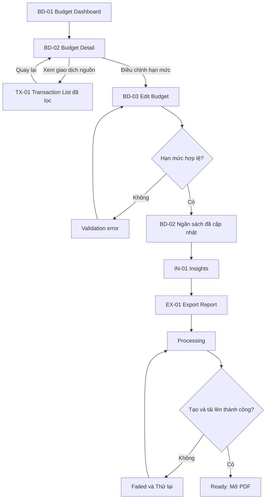

# Information Architecture và User Flow

## 1. Information architecture

### Cấp điều hướng chính

```text
Login
└── App Shell
    ├── Home
    │   ├── Add Expense
    │   ├── Transaction Detail
    │   ├── Insights
    │   │   └── Export Report
    │   └── Notification Center
    ├── Transactions
    │   ├── Add Expense
    │   └── Transaction Detail
    │       └── Edit Expense
    ├── Budgets
    │   ├── Budget Detail
    │   └── Create/Edit Budget
    └── Profile
        ├── Notification Center
        └── Export Report
```

Bottom Navigation có bốn destination: Home, Transactions, Budgets và Profile. Insights là màn hình lồng từ Home. Add Expense là hành động chính, truy cập từ Home và Transactions.

## 2. Danh sách màn hình

| ID | Màn hình | Cấp | Mục đích |
| --- | --- | --- | --- |
| AU-01 | Login | Entry | Đăng nhập Google |
| HM-01 | Home Dashboard | Root | Xem tình hình tháng và hành động tiếp theo |
| TX-01 | Transaction List | Root | Xem, tìm, lọc và sắp xếp giao dịch |
| TX-02 | Add/Edit Expense | Nested | Tạo hoặc chỉnh sửa khoản chi |
| TX-03 | Transaction Detail | Nested | Xem chi tiết, sửa hoặc xóa |
| BD-01 | Budget Dashboard | Root | Xem tiến độ ngân sách theo danh mục |
| BD-02 | Budget Detail | Nested | Xem nguyên nhân và giao dịch đóng góp |
| BD-03 | Create/Edit Budget | Nested | Thiết lập hạn mức tháng |
| IN-01 | Insights | Nested | Hiểu phân bổ chi tiêu theo danh mục |
| EX-01 | Export Report | Nested | Tạo và mở báo cáo PDF |
| NT-01 | Notification Center | Nested | Xem cảnh báo và mở đúng nội dung |
| ST-01 | Profile | Root | Xem tài khoản, demo settings và đăng xuất |

## 3. Flow 1 - Thêm khoản chi

**Điểm bắt đầu:** Home Dashboard  
**Mục tiêu:** Lưu một khoản chi hợp lệ và thấy ngân sách cập nhật.  
**Điểm kết thúc:** Home hiển thị giao dịch mới và ngân sách mới.



Nhánh lỗi/phục hồi chính là validation và network error. Form luôn giữ dữ liệu đã nhập.

## 4. Flow 2 - Chỉnh sửa hoặc xóa giao dịch

**Điểm bắt đầu:** Transaction List  
**Mục tiêu:** Sửa dữ liệu hoặc xóa nhầm có thể hoàn tác.  
**Điểm kết thúc:** Danh sách và ngân sách phản ánh dữ liệu mới.



Flow này cung cấp overlay bắt buộc và recovery path bằng Undo.

## 5. Flow 3 - Kiểm soát ngân sách và xuất báo cáo

**Điểm bắt đầu:** Budget Dashboard  
**Mục tiêu:** Xem nguy cơ vượt ngân sách, điều chỉnh hạn mức và xuất báo cáo tháng.  
**Điểm kết thúc:** Báo cáo PDF sẵn sàng để mở.



## 6. Bảng ánh xạ flow sang màn hình

| Màn hình | Flow 1 | Flow 2 | Flow 3 |
| --- | :---: | :---: | :---: |
| AU-01 Login |  |  |  |
| HM-01 Home Dashboard | ✓ |  |  |
| TX-01 Transaction List |  | ✓ | ✓ |
| TX-02 Add/Edit Expense | ✓ | ✓ |  |
| TX-03 Transaction Detail | ✓ | ✓ |  |
| BD-01 Budget Dashboard |  |  | ✓ |
| BD-02 Budget Detail |  |  | ✓ |
| BD-03 Create/Edit Budget |  |  | ✓ |
| IN-01 Insights |  |  | ✓ |
| EX-01 Export Report |  |  | ✓ |
| NT-01 Notification Center |  |  | ✓ |
| ST-01 Profile |  |  | ✓ |

Login là entry gate dùng trước tất cả flow. Notification Center và Profile được nối vào Flow 3 bằng nhánh thay thế: cảnh báo ngân sách từ Notification Center mở Budget Detail; Export Report cũng có thể mở từ Profile.

## 7. Prototype rules

- Mỗi flow có một starting point được đặt tên rõ trong Figma.
- Back quay về màn hình nguồn thực tế.
- Confirmation Dialog mở dưới dạng overlay.
- Add Expense có transition từ loading sang Transaction Detail.
- Không liên kết tắt về Home để che ngõ cụt.
- State frames đặt cạnh màn hình gốc và dùng cùng Screen ID.

