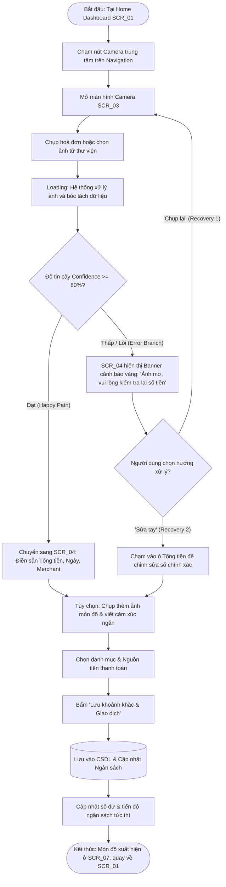
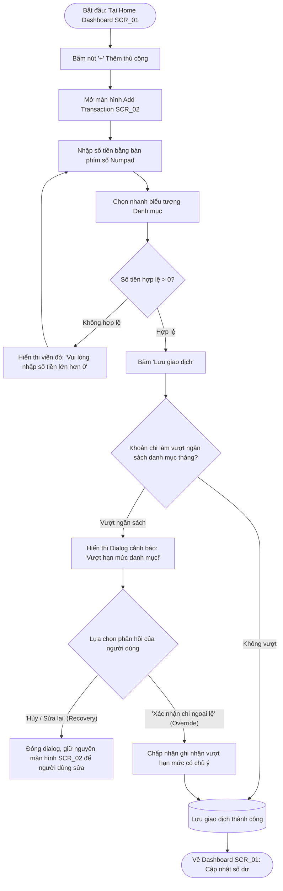
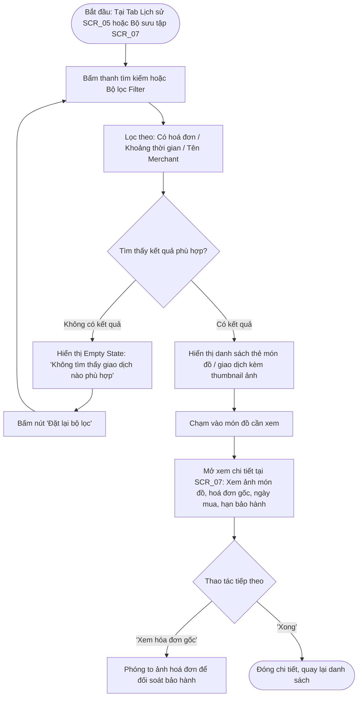

# Information Architecture & User Flows — Dự án PicKet

## Quản lý chi tiêu, lưu giữ khoảnh khắc mua sắm (Chụp → Hiểu → Kiểm soát → Nhớ lại)

---

## 1. Information Architecture (Kiến trúc thông tin & Cấu trúc điều hướng)

Ứng dụng được thiết kế theo tư duy Mobile-First với **Bottom Navigation Bar gồm 4 Tab chính** cùng **Nút hành động trung tâm (Camera Quick-Action)** để tối ưu hóa vòng lặp cốt lõi _"Chụp để ghi nhận"_:

```text
App Root (Main Application)
├── [Tab 1] Home Dashboard (SCR_01) ── Top-level
│     ├── (+) Add Transaction Manual (SCR_02) ── Modal Screen / Sheet
│     │     └── [Dialog] Budget Exceeded Warning (Overlay Dialog)
│     └── [Center Action] Scan Receipt & Item Camera (SCR_03) ── Fullscreen Modal
│           └── OCR Review & Story Attachment (SCR_04) ── Sub-screen
│                 └── [Dialog] Low Confidence Warning (Inline Alert / Dialog)
├── [Tab 2] Transaction History & Search (SCR_05) ── Top-level
│     └── Filter & Search Bottom Sheet (Lọc theo danh mục, thời gian, merchant)
├── [Tab 3] Budget & Expense Control (SCR_06) ── Top-level
│     └── Edit Category Budget Modal (Điều chỉnh hạn mức danh mục)
├── [Tab 4] Shopping Moments & Item Collection (SCR_07) ── Top-level (Nhật ký mua sắm)
│     └── Item Detail Modal (Xem ảnh món đồ, hoá đơn đính kèm, bảo hành, ghi chú)
└── [Header Action] User Settings & Financial Profile (SCR_08) ── Push Screen
```

### Danh sách 8 màn hình chính (Chuẩn kích thước 360 × 800 dp):

1. **SCR_01 - Home Dashboard (Tổng quan tài chính & Khoảnh khắc):** Số dư các nguồn tiền, tiến độ ngân sách tháng, cảnh báo tốc độ chi tiêu, danh sách giao dịch & khoảnh khắc gần đây.
2. **SCR_02 - Add Transaction Manual (Ghi nhận chi tiêu thủ công):** Bàn phím số lớn (Numpad), chọn danh mục, nguồn tiền (tiền mặt/ngân hàng/ví), ghi chú nhanh.
3. **SCR_03 - Scan Receipt & Item Camera (Camera chụp hoá đơn / món đồ):** Điểm vào nhanh nhất, hỗ trợ chụp hoá đơn trực tiếp, tự động nhận diện khung viền, bật/tắt flash, chụp kèm ảnh món đồ.
4. **SCR_04 - OCR Review & Story Attachment (Xác nhận OCR & Ngữ cảnh chi tiêu):** Xem lại kết quả bóc tách từ OCR (tổng tiền, merchant, ngày, dòng hàng), đính kèm ảnh món đồ / cảm xúc, chọn vòng tròn chia sẻ riêng tư.
5. **SCR_05 - Transaction History & Search (Sổ giao dịch & Tra cứu):** Dòng thời gian chi tiêu theo ngày, tra cứu theo tên món đồ, merchant, hóa đơn đính kèm.
6. **SCR_06 - Budget & Expense Control (Ngân sách & Kiểm soát chi tiêu):** Tiến độ chi tiêu từng danh mục, dự báo nguy cơ thâm hụt cuối tháng, đề xuất điều chỉnh không phán xét.
7. **SCR_07 - Shopping Moments & Item Collection (Nhật ký mua sắm & Bộ sưu tập món đồ):** Dạng lưới ảnh (Gallery Grid) lưu giữ các món đồ đã mua, hoá đơn bảo hành, hạn đổi trả và kỷ niệm gắn liền.
8. **SCR_08 - User Settings & Financial Profile (Cài đặt tài khoản & Ví tiền):** Quản lý các nguồn tiền (tiền mặt, thẻ, ví điện tử), thiết lập ngưỡng cảnh báo sớm, quyền riêng tư vòng tròn gia đình/cặp đôi.

---

## 2. Các User Flows chi tiết

### Flow 1: Chụp hoá đơn OCR & Đính kèm khoảnh khắc mua sắm (Smart Capture → Understand → Remember)

- **Điểm bắt đầu:** Người dùng mở ứng dụng và chạm vào nút **Camera trung tâm** tại Home Dashboard (SCR_01).
- **Mục tiêu:** Ghi nhận hoá đơn trong vài giây, tự động trích xuất số tiền/merchant và lưu giữ ảnh món đồ/câu chuyện mua sắm.
- **Điểm kết thúc:** Giao dịch được lưu vào sổ cái, ngân sách tự động cập nhật, món đồ xuất hiện trong Bộ sưu tập (SCR_07).
- **Nhánh lỗi & Phục hồi:** Ảnh chụp bị mờ / thiếu sáng khiến OCR trả về độ tin cậy thấp (Confidence < 80%) ➔ Hệ thống hiển thị cờ cảnh báo màu vàng tại SCR_04, cho phép người dùng kiểm tra, sửa nhanh số tiền hoặc chụp lại mà không làm mất thông tin khác.



---

### Flow 2: Nhập chi tiêu thủ công & Xử lý cảnh báo vượt ngân sách (Manual Expense & Budget Overrun Warning)

- **Điểm bắt đầu:** Bấm nút **(+) Thêm nhanh** tại Home Dashboard (SCR_01).
- **Mục tiêu:** Ghi nhận khoản chi tiêu tiền mặt nhỏ lẻ không có hoá đơn trong vòng dưới 15 giây.
- **Điểm kết thúc:** Giao dịch được ghi nhận, trạng thái ngân sách được phản ánh trung thực.
- **Nhánh lỗi & Phục hồi:**
  1. _Lỗi nhập liệu:_ Số tiền bằng 0 hoặc để trống ➔ Báo lỗi tại trường nhập liệu, ngăn lưu.
  2. _Cảnh báo nguy cơ:_ Khoản chi khiến ngân sách danh mục vượt 100% ➔ Hiển thị Overlay Dialog cảnh báo thâm hụt sớm và đưa ra lựa chọn phục hồi: "Hủy/Điều chỉnh số tiền" hoặc "Xác nhận khoản chi ngoại lệ có chủ ý".



---

### Flow 3: Tra cứu hoá đơn & Xem lại kỷ niệm món đồ (Search Receipt & Review Shopping Memory)

- **Điểm bắt đầu:** Người dùng cần tìm lại hoá đơn để kiểm tra bảo hành hoặc hạn đổi trả, bắt đầu tại Tab Lịch sử (SCR_05) hoặc Tab Bộ sưu tập món đồ (SCR_07).
- **Mục tiêu:** Tìm thấy chính xác món đồ và hoá đơn gốc trong vòng dưới 20 giây nhờ bộ lọc ngữ cảnh.
- **Điểm kết thúc:** Mở xem chi tiết hoá đơn gốc, thông tin bảo hành và ảnh món đồ.
- **Nhánh thay thế:** Nếu bộ lọc không tìm thấy kết quả (Empty State) ➔ Cung cấp nút "Đặt lại bộ lọc" để phục hồi danh sách ban đầu.



---

## 3. Bảng ánh xạ Flow sang Màn hình (Screen-to-Flow Mapping Table)

Đảm bảo 100% các màn hình trong danh mục 8 màn hình đều tham gia vào ít nhất một flow hoàn chỉnh:

| Mã Màn Hình | Tên Màn Hình                       |     Flow 1 (Chụp OCR & Khoảnh khắc)      | Flow 2 (Nhập tay & Cảnh báo ngân sách) | Flow 3 (Tra cứu hoá đơn & Kỷ niệm món đồ) |
| :---------- | :--------------------------------- | :--------------------------------------: | :------------------------------------: | :---------------------------------------: |
| **SCR_01**  | Home Dashboard                     |           Điểm bắt đầu (Start)           |        Điểm bắt đầu & Kết thúc         |             Quay về trang chủ             |
| **SCR_02**  | Add Transaction Manual             |                    —                     |             Màn hình chính             |                     —                     |
| **SCR_03**  | Scan Receipt & Item Camera         |        Màn hình chính (Chụp ảnh)         |                   —                    |                     —                     |
| **SCR_04**  | OCR Review & Story Attachment      | Màn hình chính (Xác nhận & Cảnh báo lỗi) |                   —                    |                     —                     |
| **SCR_05**  | Transaction History & Search       |           Xem lại sau khi lưu            |          Xem lại sau khi lưu           |        Điểm bắt đầu tra cứu & Lọc         |
| **SCR_06**  | Budget & Expense Control           |         Tự động đồng bộ số liệu          |   Nguồn kiểm tra hạn mức & Cảnh báo    |           Xem tác động chi tiêu           |
| **SCR_07**  | Shopping Moments & Item Collection |        Điểm kết thúc (Món đồ mới)        |                   —                    |   Điểm hiển thị chi tiết hoá đơn/món đồ   |
| **SCR_08**  | User Settings & Financial Profile  |         Nguồn chọn ví/nguồn tiền         |       Nguồn ngưỡng cảnh báo sớm        |      Cài đặt quyền riêng tư kho ảnh       |
